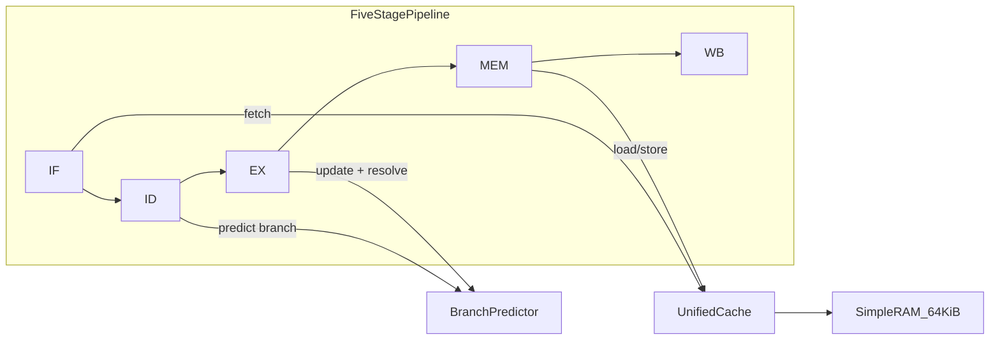

# Instructor Guide — RISC-V CPU Simulator

A concise overview for instructors evaluating this simulator for a computer architecture course.

## Elevator Pitch

- **Visual 5-stage pipeline** — Cycle-accurate RV32 simulation with real-time pipeline, register, memory, and dependency views. Students see stalls, forwarding, flushes, and branch mispredictions as they happen.
- **Unified cache framework** — Compare direct-mapped, fully associative, and set-associative (2/4/8-way) caches. Students implement custom replacement policies (FIFO, random, etc.) following [CACHE_SCHEMES.md](CACHE_SCHEMES.md).
- **Branch predictor framework** — Compare static baselines through bimodal, GShare, and tournament predictors. Students implement custom algorithms following [BRANCH_PREDICTORS.md](BRANCH_PREDICTORS.md).

## Model Assumptions (Scope)

This is a **teaching simulator**, not a formal ISA validator or QEMU replacement.

| Item | Value |
|------|--------|
| ISA | RV32IMCF-oriented subset (see [README.md](README.md#-features)) |
| RAM | 64 KiB flat physical memory at `0x00000000` |
| Cache | Unified 4 KiB, 32-byte lines (not split I/D) |
| Write policy | Write-through, write-allocate only |
| Branch prediction | Conditional branches only (`opcode 0x63`); JAL/JALR bypass predictor |
| Mispredict penalty | Pipeline flush (no extra stall cycles beyond flush) |
| Program loading | Hex text files or RV32 ELF (cross-compiled) |

**Demo tip:** Use the `_start` + [examples/simlib.h](examples/simlib.h) pattern ([fib_print.c](examples/fib_print.c)). Programs that use normal `call main` / `ret` with stack-saved `ra` may misbehave due to a known forwarding limitation.

## Recommended Demo Programs

| Demo point | Program | Why |
|------------|---------|-----|
| Pipeline + syscalls | `build/hello.elf` | Short, predictable |
| Cache hit-rate contrast | `build/fib_print.elf` | Loop + many prints → repeatable memory traffic |
| Branch predictor contrast | `build/count_primes.elf` | Nested loops, branch-heavy |
| Hex-only fallback (no cross-compiler) | `instruction_memory/instMem-forward.txt` | Zero toolchain dependencies |

Build example ELFs: `./scripts/build_example_elf.sh` (requires `riscv64-elf-gcc` or equivalent).

## 10-Minute Live Demo Script

### GUI path (primary — ~8 min)

1. **Build and launch**
   ```bash
   cmake -S . -B build -DBUILD_GUI=ON \
     -DCMAKE_PREFIX_PATH="$(brew --prefix qt@6 2>/dev/null || brew --prefix qt 2>/dev/null || echo "")"
   cmake --build build -j
   ./build/cpusim_gui
   ```

2. **Load a branch-heavy program** — Open `build/count_primes.elf` (build first with `./scripts/build_example_elf.sh`).

3. **Branch predictors** — With **Always Not Taken** selected, click **Start**. Open the **Statistics** tab and note prediction accuracy and CPI. **Reset**, switch to **GShare**, run again, and compare accuracy and CPI.

4. **Pipeline visualization** — **Reset**, use **Step** through a few cycles near a branch. Point out the predictor decision in ID and a flush on mispredict.

5. **Cache schemes** — **Reset**, open `build/fib_print.elf`. Run with **Direct Mapped**, note hit rate. **Reset**, switch to **4-way Set-Associative**, run again, compare hit rate.

6. **Extension hook** — Open [BRANCH_PREDICTORS.md](BRANCH_PREDICTORS.md) and show Step 1: students add a class in `src/memory/BranchPredictor.h`, wire the enum, factory, and GUI dropdown.

### CLI backup (~2 min)

If Qt is unavailable on the demo machine:

```bash
./scripts/demo.sh
```

Or manually:

```bash
./scripts/build_example_elf.sh
./build/cpusim build/count_primes.elf --predictor ant --bench --json
./build/cpusim build/count_primes.elf --predictor gshare --bench --json
./build/cpusim build/fib_print.elf --cache direct --bench --json
./build/cpusim build/fib_print.elf --cache 4way --bench --json
```

## Architecture Overview



For a detailed datapath diagram, see [DATAPATH+Controller.pdf](DATAPATH%2BController.pdf).

**Pipeline stages:**
1. **IF** — Fetch from unified memory (through cache)
2. **ID** — Decode, read registers, branch prediction
3. **EX** — ALU, branch resolution, forwarding
4. **MEM** — Load/store through cache
5. **WB** — Writeback to register file

## Student Extension Workflow

Students implement custom predictors or caches by editing core headers (four touch points):

1. Implement the class in [`src/memory/BranchPredictor.h`](src/memory/BranchPredictor.h) or [`src/memory/Cache.h`](src/memory/Cache.h)
2. Add an enum value in [`src/memory/BranchPredictorScheme.h`](src/memory/BranchPredictorScheme.h) or [`src/memory/CacheScheme.h`](src/memory/CacheScheme.h)
3. Add a factory case in `createBranchPredictor()` or `createCacheScheme()`
4. Add a GUI dropdown entry in [gui/MainWindow.cpp](gui/MainWindow.cpp)

After these steps, the new scheme appears in the GUI dropdown. See the step-by-step guides:

- [CACHE_SCHEMES.md](CACHE_SCHEMES.md) — cache replacement policies, write policies
- [BRANCH_PREDICTORS.md](BRANCH_PREDICTORS.md) — saturating counters, global history, hybrids

## Pre-Demo Checklist

Run before meeting with your professor:

```bash
./scripts/demo.sh          # build + canned comparisons
ctest --test-dir build     # regression tests
```

Verify `./build/cpusim_gui` launches and can open an ELF file.

## Future Classroom Enhancements

If adopted for a full course, natural next steps include:

- Pre-written lab assignments and grading scripts
- Dedicated unit tests with golden hit-rate / accuracy baselines
- Configurable cache size and associativity via CLI flags
- Predictor state visualization in the GUI
- Fix for `call`/`ret` forwarding limitation

## Additional Resources

- [README.md](README.md) — full user documentation
- [GUI_BUILD.md](GUI_BUILD.md) — Qt build instructions
- CI: [GitHub Actions](https://github.com/nishadelias/CPU_SIM/actions) (Ubuntu + macOS build and test)
